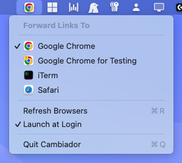

# Cambiador
[](https://github.com/jprado/cambiador/releases)

A simple macOS menu bar app for switching your default browser. Pick a browser, and all your links open there. Need to switch? Click the menu bar and choose a different one.

## Why Cambiador?
Inspired by tools like Choosy, Finicky, and Browserosaurus, Cambiador takes a simpler approach. **No rules to configure. No prompts on every link click.** Just pick your browser from the menu bar, and all links go there. When you need to switch, click the menu bar icon and choose a different one.

Perfect for when you want Safari for personal browsing and Chrome for work, or when you're testing web apps across different browsers.

## How It Works
Cambiador registers itself as a **browser application**. On first launch, it becomes your system default browser (one-time macOS confirmation). After that, every link click flows through Cambiador, which immediately forwards the URL to whichever real browser you've selected in the menu bar.

Once Cambiador is your default browser, switching which real browser handles your links is just an internal setting change. No system prompts, no delays. Instant and silent.

```
Link clicked anywhere in macOS
        ↓
macOS routes to Cambiador (the "default browser")
        ↓
Cambiador forwards to your chosen real browser
        ↓
URL opens in Chrome / Safari / Firefox / etc.
```

## Features
- **Menu bar icon** — shows the icon of your currently selected browser
- **One-click switching** — pick any browser from the dropdown, no OS confirmation
- **Auto-detection** — discovers installed browsers via Launch Services
- **Browser icons** — app icons displayed next to each browser name
- **URL validation** — only forwards `http` and `https` URLs; blocks `file://`, `javascript://`, etc.
- **Safe fallback** — falls back to Safari directly if the selected browser can't be found (no infinite loops)
- **Launch at Login** — toggle in the menu (macOS 13+)
- **Reclaim default** — if something else takes over as default browser, a menu item lets you reclaim it
- **Lightweight** — native Swift/AppKit, no external dependencies, minimal resource usage



## Download
Grab the latest `Cambiador-v*.dmg` from the [Releases page](https://github.com/jprado/cambiador/releases):

1. Open the `.dmg` and drag **Cambiador.app** into your **Applications** folder.
2. On first launch, macOS Gatekeeper will block the app because it isn't notarized.  
   **Right-click (or Control-click) Cambiador.app → Open → Open** to allow it once.  
   *(Alternatively: System Settings → Privacy & Security → scroll down → "Open Anyway".)*
3. macOS asks once if Cambiador can become your default browser — say **Allow**.
4. The menu bar icon appears. You're done.

**Optional — verify the download:**
```bash
shasum -c Cambiador-v*.dmg.sha256
```

## Build from Source
No pre-built binary needed — you can build it yourself with Xcode:

```bash
git clone https://github.com/jprado/cambiador.git
cd cambiador
open Cambiador.xcodeproj
```

Build and run in Xcode (⌘R). No Apple Developer account needed.

To produce a release DMG locally:

```bash
./scripts/build-release.sh        # uses version from Info.plist
# or
./scripts/build-release.sh 1.2.0  # specify version explicitly
# → dist/Cambiador-v<VERSION>.dmg
```

On first run, macOS will ask once if you want Cambiador as your default browser — say yes.
Cambiador remembers your previous default browser and pre-selects it in the menu.

## Usage
1. Click the Cambiador icon in the menu bar
2. Select any browser from the "Forward Links To" list
3. The checkmark moves instantly — no confirmation dialog
4. All links now open in your selected browser

## Requirements
- macOS 12.0 (Monterey) or later
- **To build from source:** Xcode

## Security
- **URL scheme validation** — only `http` and `https` URLs are forwarded; all other schemes are blocked and logged
- **No infinite loops** — fallback paths open Safari directly by app URL, never through `NSWorkspace.shared.open(url)` which would route back to Cambiador
- **Sandbox disabled** — required for Launch Services API access; the app has no network activity of its own
- **Preferences in UserDefaults** — selected browser stored as a bundle ID string in standard UserDefaults

## License
MIT License

## Contributing
This is intentionally a minimal tool, but improvements to browser detection, UI polish, and bug fixes are always appreciated.
